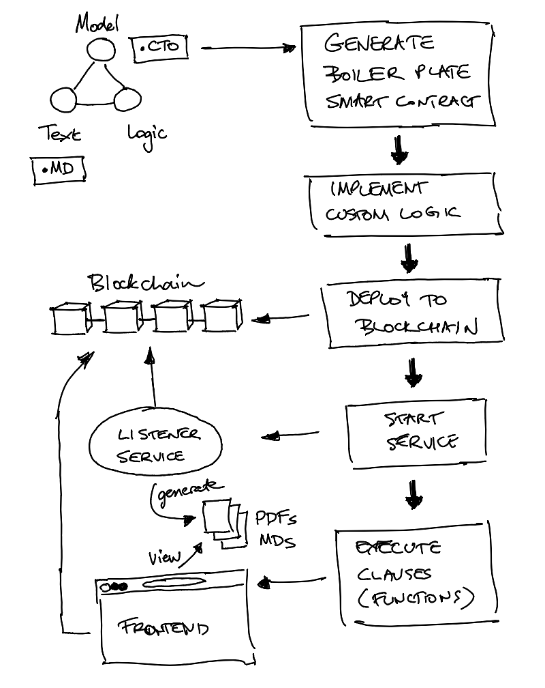

# Concerto Rust Code Generator

Code generator that transforms Concerto model definitions (.cto files) into executable Rust projects with business logic integration.

# Smart Rust Contract Workflow



## **Working Integration**

- **ink! Smart Contract** deployed to Substrate - See [more here](https://use.ink/)
- **ink!athon Frontend** with blockchain integration - See [more here](https://use.ink/docs/v5/getting-started/inkathon/)
- **Draft Service** for real-time document generation

## **⚡ 5-Minute Quick Start**

Get the complete integration running instantly:

### Prerequisites

- **Node.js** 18+
- **Rust + Cargo** (for contract compilation) - [Install here](https://rustup.rs/)
- **pnpm** (install with `npm install -g pnpm`)

### 1. Install Dependencies

```bash
# Root dependencies
npm install

# Frontend dependencies
cd inkathon && pnpm install
cd ..

# Draft service dependencies
cd draft-service && npm install
cd ..
```

### 2. Start All Services (3 Terminals)

**Terminal 1 - Draft Service:**

```bash
cd draft-service
npm start
```

_Should show: "Draft service listening on port 3001"_

**Terminal 2 - Substrate Node:**

```bash
# If you have a local startup script
./scripts/start_node_local.sh --persistent

# Or install and run substrate-contracts-node directly
cargo install contracts-node --git https://github.com/paritytech/substrate-contracts-node.git
substrate-contracts-node --dev --ws-external --rpc-external
```

**Don't have a Substrate node with contracts pallet? Choose an option:**

**Option A: Install substrate-contracts-node (Recommended)**

```bash
# Install the official contracts node
cargo install contracts-node --git https://github.com/paritytech/substrate-contracts-node.git

# Run the development node
substrate-contracts-node --dev --ws-external --rpc-external
```

**Option B: Use Docker**

```bash
# Pull and run the official Docker image
docker run --rm -p 9944:9944 parity/contracts-node:latest \
  --dev --ws-external --rpc-external
```

**Option C: Build from source**

```bash
# Clone and build the contracts node
git clone https://github.com/paritytech/substrate-contracts-node.git
cd substrate-contracts-node
cargo build --release
./target/release/substrate-contracts-node --dev --ws-external --rpc-external
```

_Should show: "Development chain running" and WebSocket server listening on 127.0.0.1:9944_

**Terminal 3 - Frontend:**

```bash
cd inkathon/frontend
pnpm run dev
```

_Should show: "Ready - started server on http://localhost:3000"_

### 3. Test the Integration

1. **Open Frontend**: Navigate to `http://localhost:3000`
2. **Connect Wallet**: Click "Connect Wallet" and select a Substrate account (install [Polkadot.js extension](https://polkadot.js.org/extension/) if needed)
3. **Submit Draft Request**: Fill in contract details:
   ```json
   {
     "buyer": "Alice Corp",
     "seller": "Bob Industries",
     "deliveryDate": "2024-01-15",
     "penaltyRate": "5%"
   }
   ```
4. **Watch Real-time Updates**: See documents appear in "Generated Documents" section
5. **Download Contract**: Click download button to get your generated contract

## **🎯 How It Works**

```
Frontend Request → Smart Contract → Event Emission → Draft Service → Document Generation → Real-time UI Update
```

1. Frontend submits request to ink! smart contract
2. Contract emits `DraftRequested` event with template data
3. Draft service detects event and generates contract using Accord Project templates
4. Generated document saved and contract updated with result
5. Frontend automatically polls API and displays new document

## **📁 Architecture Overview**

```
concerto-codegen-rust/
├── src/
│   ├── generate.js                       # Core Rust generation engine
│   ├── generate-ink.js                   # ink! Smart Contract generator
│   └── utils.js                          # Project utilities
├── archives/
│   └── latedeliveryandpenalty/           # Template archives (Accord Project format)
│       ├── model/
│       │   ├── model.cto                 # Main template model
│       │   └── *.cto                     # Accord Project base models
│       ├── logic/                        # Template logic (reference)
│       ├── text/                         # Template grammar (reference)
│       └── package.json                  # Template metadata
├── inkathon/                             # Complete Frontend Integration
│   ├── frontend/                         # React frontend with Polkadot.js
│   └── contracts/                        # Deployed ink! contracts
├── draft-service/                        # Document Generation Service
│   ├── src/index.js                      # Event listener & API server
│   ├── logs/                             # Service logs (ignored by git)
│   └── generated-documents/              # Generated contract documents
├── output/                               # Generated Rust project ⚡
```

## **🔧 Code Generation**

### Generate Rust Models

```bash
npm run generate
```

**What gets generated:**

- Complete, executable Rust project in `output/`
- Type-safe model structures from your `.cto` files
- Business logic boilerplate with TODO markers
- Comprehensive test framework with synthetic data
- JSON-compatible serialization with proper field naming

### Generate ink! Smart Contract

```bash
node src/generate-ink.js
cd output/ink-contract
cargo contract build       # Build the smart contract
cargo test                  # Run contract tests
```

**ink! Features:**

- **Substrate Compatible**: Deploys to any Substrate blockchain with contracts pallet
- **Storage Management**: Contract state derived from your Concerto models
- **Event Emission**: Automatic event generation for all contract actions
- **Access Control**: Owner-based permissions and pausable functionality
- **Transaction Processing**: Type-safe request/response handling

### Build and Test Generated Code

```bash
cd output
cargo build    # Compiles the generated Rust code
cargo run      # Runs demo with synthetic data
cargo test     # Runs comprehensive test suite
```

## **📦 Generated Output Structure**

```
output/
├── Cargo.toml              # Complete Rust project configuration
├── README.md               # Generated project documentation
├── src/
│   ├── lib.rs             # Main library with module exports
│   ├── main.rs            # Executable demo with synthetic data
│   ├── logic.rs           # Business logic boilerplate with TODO markers
│   ├── utils.rs           # DateTime and serialization utilities
│   └── *.rs               # Generated model files (one per namespace)
└── ink-contract/           # ink! Smart Contract (if generated)
    ├── Cargo.toml          # ink! project configuration
    ├── README.md           # Contract documentation
    └── src/
        └── lib.rs          # ink! smart contract code
```

### Key Features

- **✅ Immediately Executable**: Run `cargo run` for instant demo with synthetic data
- **✅ Business Logic Boilerplate**: `logic.rs` with function signatures derived from .cto models
- **✅ Testing**: Test framework with realistic synthetic data
- **✅ Type Safety**: All request/response handling is type-safe
- **✅ JSON Compatible**: Full serialize/deserialize with proper field naming
- **✅ DateTime Support**: ISO 8601 compatible DateTime serialization
- **✅ TODO Markers**: Clear guidance on where to implement business logic

## **🌐 Frontend Integration Details**

### Complete React Application

The `inkathon/frontend/` provides:

- **React + TypeScript**: Modern, type-safe frontend
- **Polkadot.js Integration**: Connect any Substrate wallet
- **Real-time Document Generation**: See contracts created instantly
- **Document Management**: Download and view generated contracts
- **Transaction History**: Track all blockchain interactions

### Environment Configuration

Create `.env.local` in `inkathon/frontend/`:

```bash
# Default Chain (Local Development)
NEXT_PUBLIC_DEFAULT_CHAIN=development

# Draft Service Configuration
NEXT_PUBLIC_DRAFT_SERVICE_URL=http://localhost:3001
```

### API Endpoints

The draft service exposes:

- `GET /health` - Health check
- `GET /status` - Service status
- `GET /documents` - List all generated documents
- `GET /documents?address={wallet}` - List documents for specific address
- `GET /documents/{filename}` - Download specific document

## **📝 Example Generated Code**

### Type-Safe Model Structures

```rust
#[derive(Debug, Serialize, Deserialize, Clone)]
pub struct YourRequestType {
    #[serde(rename = "$class")]
    pub _class: String,

    pub field_name: String,

    #[serde(skip_serializing_if = "Option::is_none")]
    pub optional_field: Option<DateTime<Utc>>,

    #[serde(rename = "$timestamp")]
    pub _timestamp: DateTime<Utc>,
}
```

### Executable Business Logic Boilerplate

```rust
pub struct ContractLogic;

impl ContractLogic {
    pub async fn trigger(
        &self,
        template_data: &YourTemplateType,
        request: &YourRequestType,
    ) -> Result<ContractResponse, Box<dyn std::error::Error>> {

        // TODO: Implement your business logic here

        let response = YourResponseType {
            _class: "your.namespace.YourResponseType".to_string(),
            result_field: 0.0, // TODO: Calculate based on business logic
            _timestamp: Utc::now(),
        };

        Ok(ContractResponse { result: response })
    }
}
```

### Comprehensive Test Framework

```rust
#[tokio::test]
async fn test_logic_trigger() {
    let logic = ContractLogic::new();

    // Synthetic test data generated from your models
    let template_data = YourTemplateType { /* ... */ };
    let request = YourRequestType { /* ... */ };

    let result = logic.trigger(&template_data, &request).await;
    assert!(result.is_ok());

    // TODO: Add your specific business logic assertions
}
```

## **🔧 Troubleshooting**

### Common Issues

**"No wallet found"**

- Install [Polkadot.js browser extension](https://polkadot.js.org/extension/)

**"Contract ABI not found"**

```bash
cd inkathon/contracts/late-delivery-and-penalty
cargo contract build
```

**"Draft service not responding"**

```bash
curl http://localhost:3001/health
```

**"Substrate node not starting"**

- If using `substrate-contracts-node`, install it first: `cargo install contracts-node`
- Alternatively, use your local script: `./scripts/start_node_local.sh --persistent`
- Ensure ports 9944 (WebSocket) and 9933 (RPC) are available

**"No documents appearing"**

1. Check draft service logs for event detection
2. Verify contract address matches in both frontend and service
3. Ensure Substrate node is running with contracts pallet

### Success Indicators

You'll know it's working when you see:

- ✅ "Connected to Substrate node" in draft service logs
- ✅ "Contract events detected" messages
- ✅ New `.md` files in `generated-documents/`
- ✅ Documents appearing in frontend "Generated Documents" section
- ✅ Download buttons working for completed contracts

## **🎨 Adding Your Own Models**

Place any valid, uncompressed template archive into the `archives/` subdirectory:

```
archives/your-domain/
├── model/
│   ├── model.cto       # Your main model definitions
│   └── *.cto           # Additional dependencies
├── logic/              # Reference logic (optional)
├── text/               # Reference grammar (optional)
└── package.json        # Metadata
```

Run `npm run generate` and get an executable Rust implementation, ready for further coding.

## **🚀 Production Deployment**

### Infrastructure Requirements

**Prerequisites:**

- **Substrate Node**: Local development chain or testnet/mainnet
- **Node.js Environment**: For off-chain service (Node.js 18+)
- **PostgreSQL** (optional): For persistent logging
- **Rust + Cargo + cargo-contract**: For contract compilation

### Step 1: Deploy ink! Smart Contract

```bash
# Build the contract
cd output/ink-contract/
cargo contract build

# Deploy to testnet/mainnet
cargo contract instantiate --constructor new \
  --args true 2 10500000000 55000000000 15 "days" \
  --suri "your-production-account" \
  --url wss://your-substrate-rpc.com

# Note the contract address for service configuration
export CONTRACT_ADDRESS="your-deployed-contract-address"
```

**Update Deployment Configuration:**

After deployment, update the contract address in the appropriate network file:

```typescript
// inkathon/contracts/late-delivery-and-penalty/deployments/{network}.ts
export const address = "your-deployed-contract-address";

export const deploymentInfo = {
  network: "your-network-name",
  deployedAt: "2024-01-01",
  deployedBy: "your-account",
  blockNumber: 12345,
};
```

### Step 2: Deploy Draft Service

**Environment Configuration (.env):**

```env
# Production Substrate Node
SUBSTRATE_WS_URL=wss://your-production-node.com
CONTRACT_ADDRESS=your-deployed-contract-address

# Document Storage
DOCUMENTS_OUTPUT_DIR=./generated-documents
DOCUMENTS_BASE_URL=https://your-domain.com/documents

# Service Configuration
PORT=3001
LOG_LEVEL=info

# Security
SERVICE_PRIVATE_KEY=your-production-private-key
AUTHORIZED_CALLER=your-authorized-address

# Template Configuration
TEMPLATE_ARCHIVE_PATH=../archives/latedeliveryandpenalty
OUTPUT_FORMAT=md
```

### Step 3: Hosting Options

**Option A: Cloud Infrastructure (Recommended)**

```yaml
# kubernetes-deployment.yaml
apiVersion: apps/v1
kind: Deployment
metadata:
  name: draft-service
spec:
  replicas: 3
  selector:
    matchLabels:
      app: draft-service
  template:
    metadata:
      labels:
        app: draft-service
    spec:
      containers:
        - name: draft-service
          image: your-registry/draft-service:latest
          ports:
            - containerPort: 3001
          env:
            - name: SUBSTRATE_WS_URL
              value: "wss://your-substrate-rpc.com"
            - name: CONTRACT_ADDRESS
              valueFrom:
                secretKeyRef:
                  name: contract-secrets
                  key: address
```

**Option B: Docker Compose (VPS)**

```yaml
# docker-compose.yml
version: "3.8"
services:
  draft-service:
    build: ./draft-service
    ports:
      - "3001:3001"
    environment:
      - SUBSTRATE_WS_URL=wss://your-substrate-rpc.com
      - CONTRACT_ADDRESS=your-contract-address
    volumes:
      - ./archives:/app/archives
      - ./logs:/app/logs

  frontend:
    image: nginx:alpine
    ports:
      - "80:80"
    volumes:
      - ./inkathon/frontend/out:/usr/share/nginx/html
```

### Step 4: Security Considerations

**Smart Contract Security:**

```rust
// Only authorized service can submit results
#[ink(message)]
pub fn submit_draft_result(&mut self, request_id: u64, document_url: String) -> Result<()> {
    let caller = self.env().caller();
    if caller != self.owner {
        return Err(ContractError::Unauthorized);
    }
    // Implementation continues...
}
```

**Service Security:**

- Use environment variables for sensitive configuration
- Implement rate limiting for API endpoints
- Validate all input data before processing
- Use HTTPS for all external communications
- Regularly update dependencies

### Step 5: Monitoring & Maintenance

**Health Checks:**

```bash
# Service health
curl https://your-domain.com/health

# Check document generation
curl https://your-domain.com/documents
```

**Logging:**

- Service logs automatically saved to `logs/` directory
- Monitor for "Connected to Substrate node" messages
- Track "Contract events detected" for processing status
- Set up alerts for error patterns

## **📄 License**

Apache License 2.0 - see [LICENSE](LICENSE) for details.
